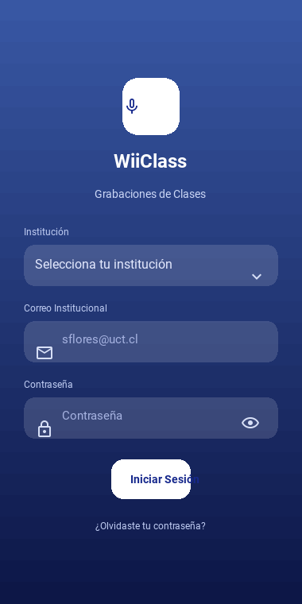
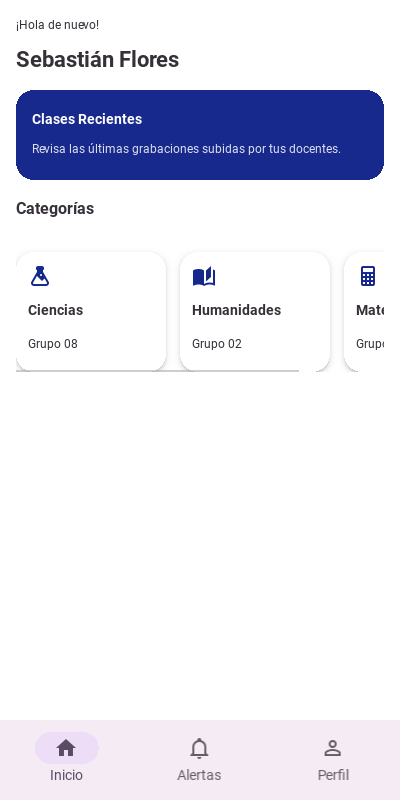
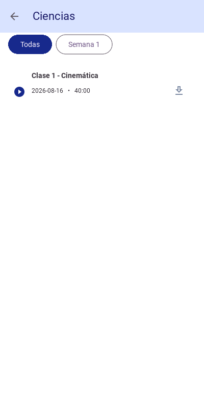
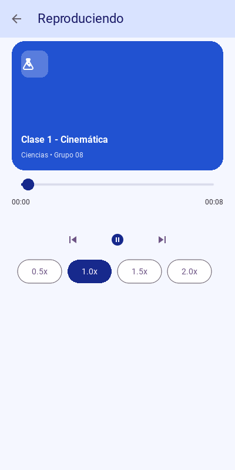
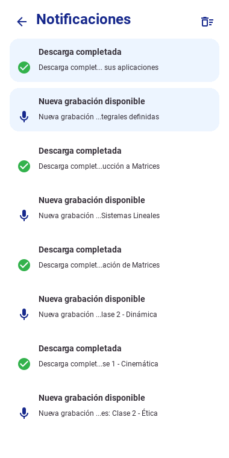

# WiiClass

Maqueta funcional (Kivy + KivyMD 2.0) de una app móvil para grabar y
descargar clases en audio, pensada para funcionar sobre el WiFi del
campus incluso con mala conexión a internet fuera de él.

> Documentación técnica extendida (decisiones de implementación, bugs
> encontrados y su solución, notas de rendimiento): ver [`README2.md`](README2.md).
> Fundamentación UX/UI (investigación con usuarios y trazabilidad
> hallazgo → decisión de diseño): ver [`FUNDAMENTACION-UX-UI.md`](FUNDAMENTACION-UX-UI.md).

## Problema que resuelve

Muchos estudiantes no logran seguir el ritmo de una clase mientras
también toman apuntes, y depender solo de la memoria o de apuntes
ajenos para repasar es poco confiable. WiiClass permite grabar la
clase, organizarla por asignatura/semana y volver a escucharla —
incluyendo un modo **sin conexión**, para quienes no tienen datos
móviles fuera del campus y solo pueden descargar el audio mientras
están conectados al WiFi de la universidad.

## Usuario objetivo

Estudiantes de educación superior (el diagnóstico de este curso se
levantó con estudiantes UC Temuco) que:
- Comparten cursos organizados por categorías/asignatura y grupo.
- Tienen acceso confiable a WiFi solo dentro del campus.
- Necesitan repasar contenido grabado a distintas velocidades de
  reproducción.

## Capturas de pantalla

| Login | Inicio | Categoría | Reproductor | Notificaciones |
|---|---|---|---|---|
|  |  |  |  |  |

## Requisitos y ejecución

```bash
pip install -r requirements.txt
python3 main.py
```

La primera ejecución crea `wiiclass.db` (SQLite) con datos de ejemplo:
- Institución: Universidad Central
- Usuario demo: `sflores@uct.cl` / contraseña `12345678`

> `ffpyplayer` habilita el control real de velocidad de reproducción
> (0.5x/1.0x/1.5x/2.0x). Si no está disponible en el sistema, la app
> hace *fallback* automático a `kivy.core.audio` sin cambio de
> velocidad — no impide ejecutar la app.

## Alcance técnico de esta entrega (E2)

- Interfaz construida íntegramente en Kivy + KivyMD (sin Figma ni imágenes estáticas).
- 5 pantallas navegables con `MDScreenManager` (Login, Principal con
  bottom nav, Categoría, Reproductor, Notificaciones) + 4 tabs internos
  (Inicio, Descargas, Alertas, Perfil) sincronizados con `MDNavigationBar`.
- Separación interfaz/lógica: cada pantalla tiene su `.py` (lógica) y su
  `.kv` (KV Language) del mismo nombre.
- Componentes KivyMD con Material Design: `MDTopAppBar`, `MDButton`,
  `MDCard`, `MDDialog`, `MDIcon`, `MDNavigationBar`, `MDDropdownMenu`.
- Interacción funcional: login con validación de campos y credenciales,
  reproducción con control de velocidad, descarga simulada a
  almacenamiento local, selección múltiple con "mantener presionado",
  notificaciones deslizables.
- **Fuera de alcance** (no se exige en E2): persistencia real en
  servidor, autenticación real, notificaciones push, configuración
  remota.

## Estructura del proyecto

```
main.py                 # Punto de entrada, navegación global
db.py                   # Esquema SQLite + consultas (datos de ejemplo)
audio_player.py         # Motor de audio (play/pause/seek/velocidad)
downloads_manager.py    # Descarga (copia local) a almacenamiento offline
requirements.txt
assets/
  audio/                # Audios de ejemplo
  screenshots/           # Capturas usadas en este README
screens/
  login_screen.py/.kv
  main_screen.py/.kv
  home_tab.py/.kv
  category_screen.py/.kv
  player_screen.py/.kv
  notifications_tab.py/.kv
  notifications_all_screen.py/.kv
  notification_widgets.py/.kv
  notifications_state.py
  profile_tab.py/.kv
  downloads_tab.py/.kv
```

## Declaración de uso de IA

Se usó IA (Claude, Anthropic) como asistente de desarrollo sobre el
código ya existente del repositorio para: diagnosticar y corregir un
bug de rendimiento (chequeo de conectividad bloqueando el hilo
principal en el login, ver detalle en `README2.md`), y para redactar
este README y el documento de fundamentación UX/UI. El diseño de la
app, las decisiones de arquitectura (Kivy+KivyMD, ScreenManager,
separación .py/.kv) y la implementación original de cada pantalla son
del equipo.
